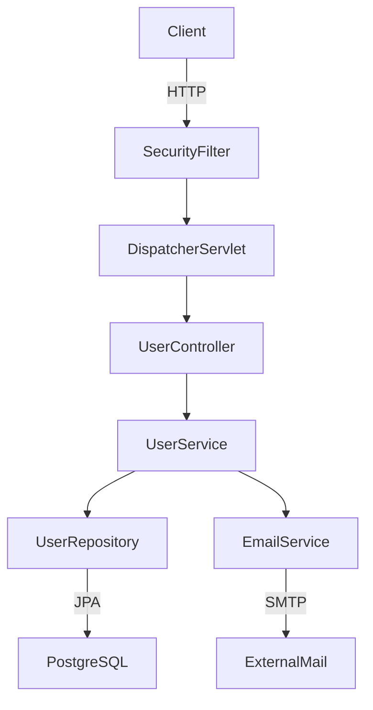

Here's a comprehensive guide for using Codex CLI to load and analyze a Java project, generate diagrams, map endpoints, and trace control flow.

---

## Setup

### Install & Authenticate

```bash
# Install (Node.js 22+ required)
npm install -g @openai/codex

# Or via Homebrew
brew install codex

# Authenticate (ChatGPT Pro/Plus or API key)
codex login
# or
export OPENAI_API_KEY=sk-...
```

### Launch in read-only mode first (safe for unfamiliar codebases)

```bash
cd /path/to/java-project
codex --sandbox read-only
```

Codex reads key files and explains the codebase — no changes are made in the default suggest mode.

---

## Step 1: Prime Codex with an `AGENTS.md`

Drop this file in the project root before your first session. AGENTS.md is a README for the agent — write how to work on this codebase (setup, build, test, lint, PR rules, security guardrails).

```markdown
# AGENTS.md

## Project type
Java 17, Spring Boot 3.x, Maven

## Build
- `mvn clean compile` to build
- `mvn test` to run tests
- `mvn spring-boot:run` to start

## Layout
- `src/main/java/` — application source
- `src/main/resources/` — configs, application.yml
- `src/test/` — unit and integration tests

## Analysis rules
- Do NOT modify any source files unless explicitly asked
- When mapping endpoints, include HTTP method, path, controller class, and method name
- When generating diagrams, use Mermaid syntax
- Output diagrams to `docs/diagrams/`
```

Merge order: Codex concatenates files from the root down; files closer to your current directory override earlier guidance because they appear later in the combined prompt.

---

## Step 2: Initial Codebase Orientation

Launch and ask for a structural overview:

```
> Give me a high-level overview of this Java project:
  - Module structure and package layout
  - Key dependencies from pom.xml
  - Entry points (main class, Spring Boot application class)
  - Configuration files and what they control
```

Then drill deeper:

```
> List all classes grouped by layer:
  controllers, services, repositories, models/entities, DTOs, utilities
  Format as a table with class name, package, and brief purpose.
```

---

## Step 3: Map All Exposed Endpoints

```
> Scan all @RestController and @Controller classes.
  For each endpoint produce a table with:
  - HTTP method
  - Full path (including class-level @RequestMapping prefix)
  - Controller class and method name
  - Request body type (if any)
  - Response type
  - Auth required (check for @PreAuthorize, Spring Security filters)
```

For non-Spring projects (JAX-RS, Micronaut, Quarkus):

```
> Find all @Path, @GET, @POST, @PUT, @DELETE annotations (JAX-RS).
  Map the same fields: method, path, handler class/method, I/O types.
```

Follow up for OpenAPI generation:

```
> Generate an OpenAPI 3.0 YAML spec for all discovered endpoints.
  Save it to docs/openapi.yaml
```

---

## Step 4: Generate Architecture Diagrams

### Package / module diagram

```
> Generate a Mermaid component diagram showing:
  - Top-level packages as components
  - Dependencies between them (which packages import which)
  Save to docs/diagrams/architecture.md
```

### Class relationship diagram

```
> Generate a Mermaid class diagram for the domain model:
  - All @Entity classes and their fields
  - Relationships: @OneToMany, @ManyToOne, @ManyToMany
  - Inheritance hierarchies
```

### Layered architecture diagram

```
> Generate a Mermaid flowchart showing the layered architecture:
  HTTP request → Filter chain → Controller → Service → Repository → DB
  Include any async queues, caches (Redis/Caffeine), or external HTTP clients.
```

Example Mermaid output Codex will produce:



---

## Step 5: Control Flow Tracing

For a specific feature or endpoint:

```
> Trace the full control flow for POST /api/v1/orders:
  - Start from the controller method
  - Follow every service and repository call
  - Note any async dispatch (@Async, CompletableFuture, events)
  - Note any external calls (REST clients, Kafka, etc.)
  - Show as a Mermaid sequence diagram
```

For exception handling:

```
> Map all exception handling paths:
  - @ControllerAdvice / @ExceptionHandler classes
  - What exceptions are caught and what HTTP status codes are returned
  - Any custom error response types
```

For transaction boundaries:

```
> Find all @Transactional annotations. For each:
  - Which service methods are transactional
  - propagation and isolation levels if non-default
  - What DB operations are grouped in the same transaction
```

---

## Step 6: Security & Auth Analysis

```
> Analyze the security configuration:
  - Spring Security filter chain configuration
  - Which endpoints are public vs protected
  - JWT/OAuth2/session handling
  - Method-level security (@PreAuthorize expressions)
  Generate a table: endpoint → auth requirement → roles allowed
```

---

## Step 7: Database Schema

```
> From all @Entity classes and Flyway/Liquibase migrations, 
  generate a Mermaid ER diagram showing:
  - Tables and their columns (with types)
  - Primary and foreign key relationships
  Save to docs/diagrams/schema.md
```

---

## Step 8: Dependency & Config Analysis

```
> Analyze pom.xml (or build.gradle):
  - List all direct dependencies with versions
  - Flag any known CVEs or outdated libraries
  - Identify test vs. compile vs. runtime scope

> Analyze application.yml / application.properties:
  - What external systems are configured (DB, Redis, Kafka, S3, etc.)
  - What feature flags or profiles exist
  - Any hardcoded secrets or suspicious values
```

---

## Useful Session Management

```bash
# Start with a prompt immediately
codex "Analyze this Spring Boot project and give me an overview"

# Non-interactive: pipe output to a file
codex --ask-for-approval never \
  "List all REST endpoints as JSON" > docs/endpoints.json

# Use the cloud for heavier analysis (parallel tasks)
codex cloud exec --env YOUR_ENV_ID \
  "Generate all diagrams and save to docs/diagrams/"
```

Write prompts around intent, not syntax — tell Codex what you want it to achieve, not just what code to write. Use AGENTS.md to set the rules; codify your project's style, build commands, and constraints so Codex always has the right context.

---

## Recommended Session Workflow Summary

| Phase | What to ask |
|---|---|
| 1. Orient | Package layout, entry points, key deps |
| 2. Endpoints | Full REST/JAX-RS map with I/O types |
| 3. Architecture | Component + layered diagrams (Mermaid) |
| 4. Domain model | Class + ER diagrams |
| 5. Control flow | Sequence diagrams per feature |
| 6. Security | Auth map, filter chain, roles |
| 7. Config/infra | External systems, profiles, secrets |
| 8. Output | OpenAPI YAML, `docs/diagrams/*.md` |

Keep `AGENTS.md` updated as you learn the codebase — it carries across sessions and keeps Codex grounded in your project's specifics.
