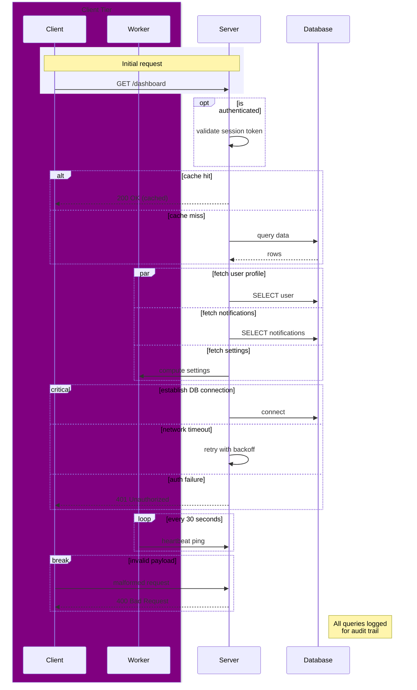

Here's a single diagram exercising each construct:

Quick notes on what's demonstrated:

- **`box`** groups Client + Worker visually as one tier
- **`rect`** shades the initial request/response pair
- **`opt`** — single-branch conditional (session check)
- **`alt`/`else`** — cache hit vs miss branching
- **`par`** — three concurrent fetches with `and`
- **`critical`/`option`** — a must-run block with two fallback paths
- **`loop`** — recurring heartbeat
- **`break`** — abnormal exit path (renders with a distinct highlighted style, usually red-tinted, to signal "flow stops here")
- **`Note`** — free-form annotation, no `end` needed for single-participant notes

If you paste this into a Mermaid live editor or a renderer that supports it, you'll see each block's visual treatment differs (dashed vs solid borders, background tint for `rect`, etc.) — useful for eyeballing which construct you're looking at in someone else's diagram.