Here are rich examples of each Mermaid type:

---

## Flowchart
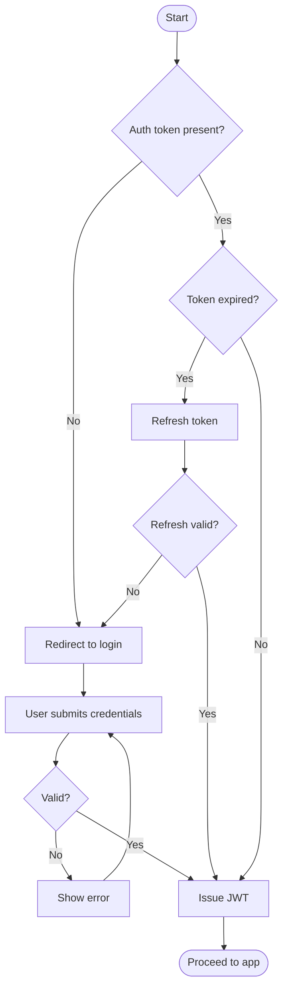

---

## Sequence Diagram
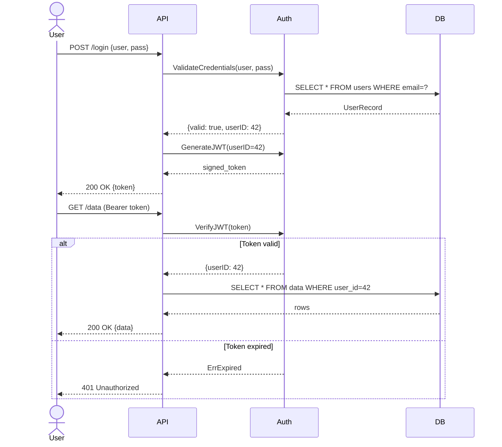

---

## Class Diagram
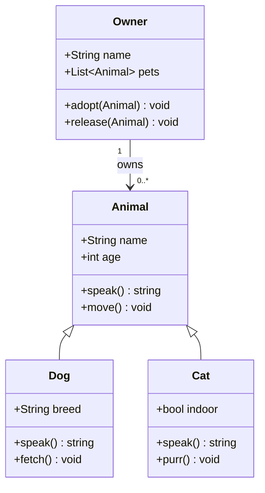

---

## State Diagram
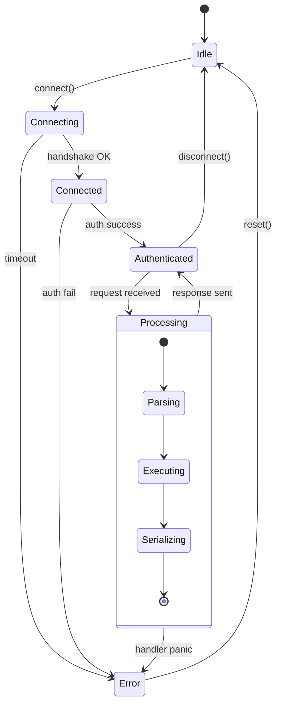

---

## Entity Relationship
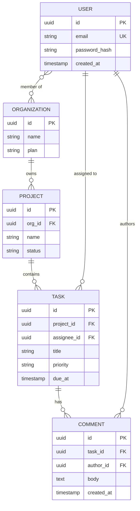

---

## Git Graph
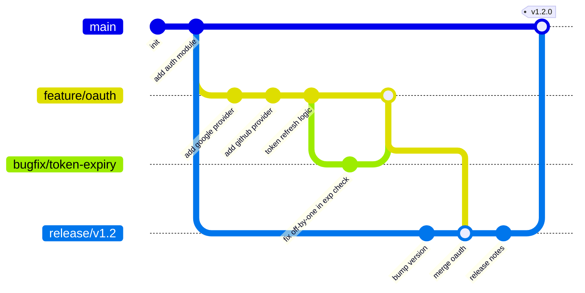

---

## Gantt
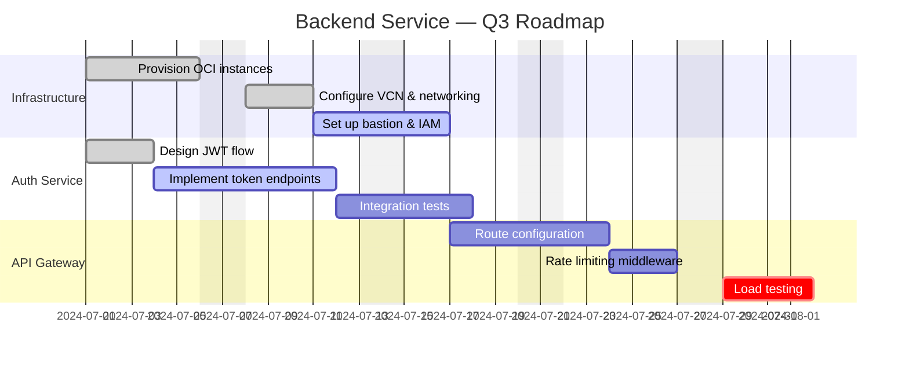

---

## C4 Diagram
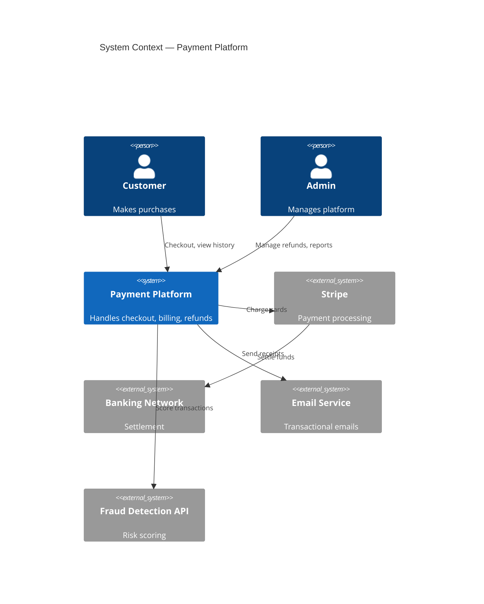

---

## Pie Chart
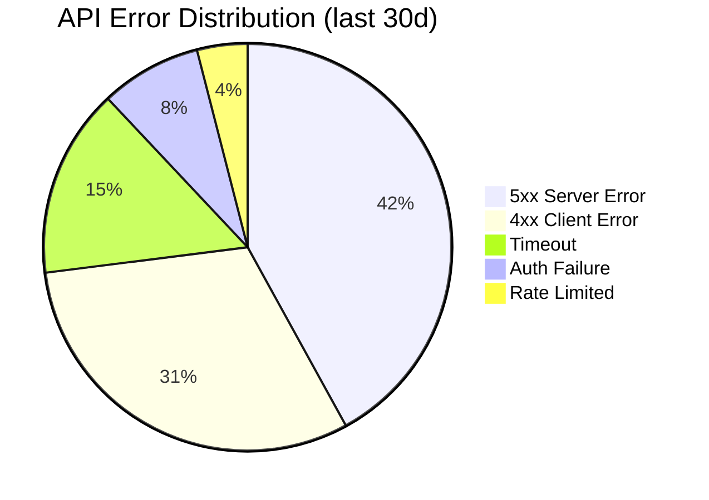

---

## Timeline
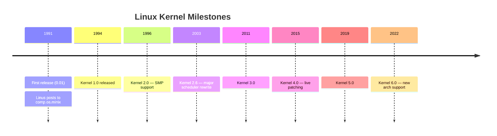

---

## Mindmap
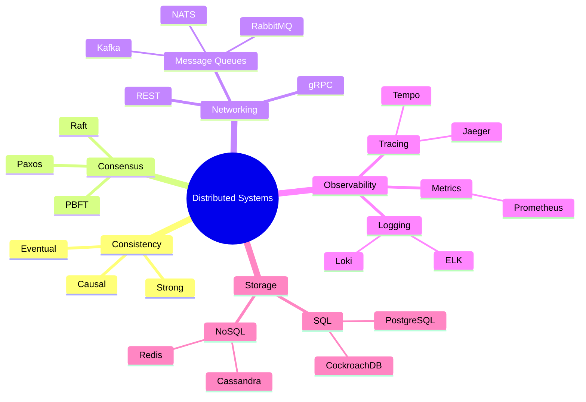

---

## User Journey
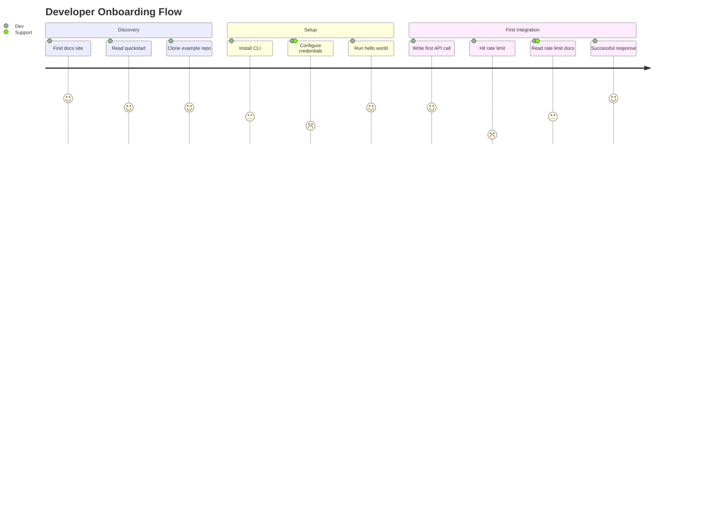

---

## XY Chart
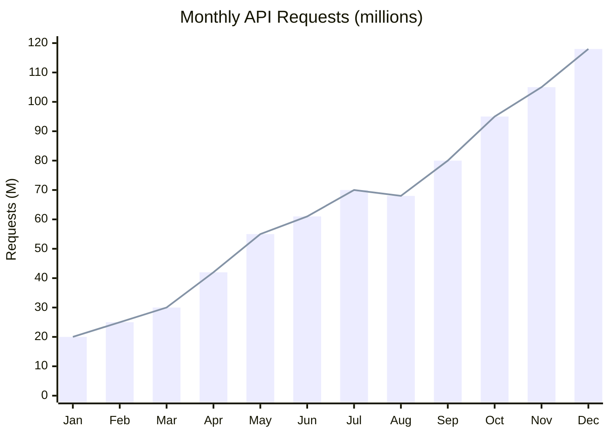

---

## Quadrant Chart
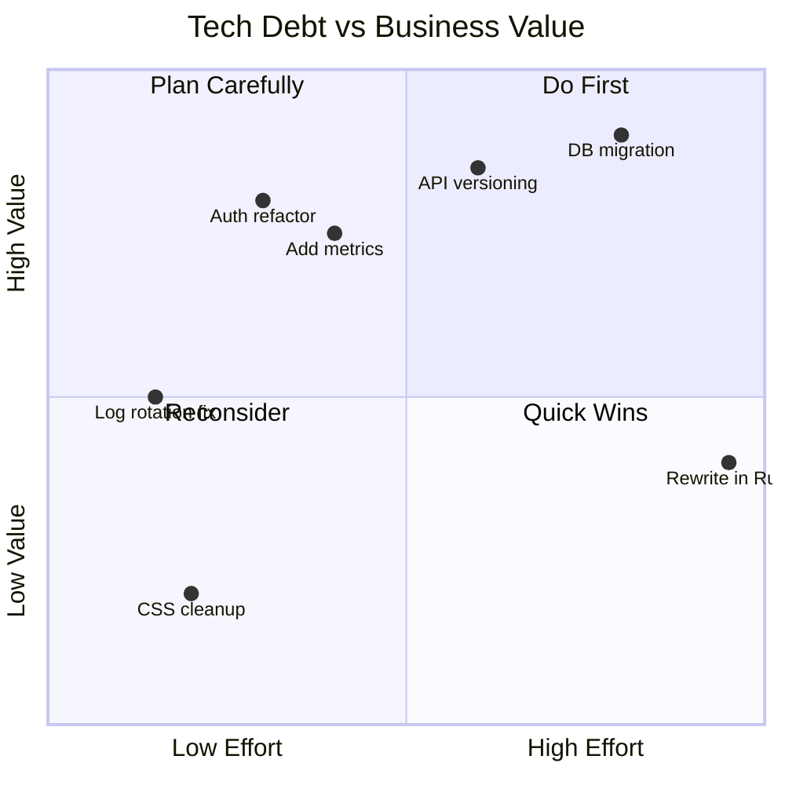

---

## Sankey
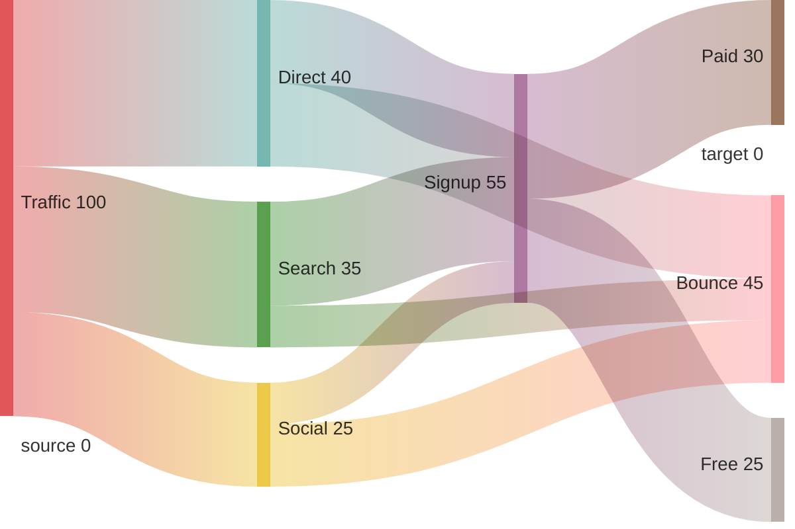

---

## Block Diagram
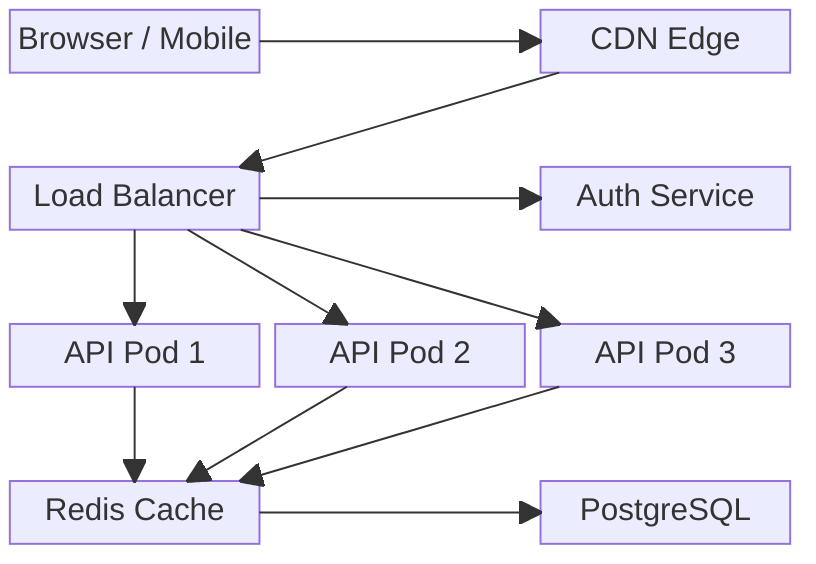

---

That covers all major types. The ones most useful for systems/infra work (your domain) are **Flowchart**, **Sequence**, **ER**, **State**, **C4**, and **Git Graph**.