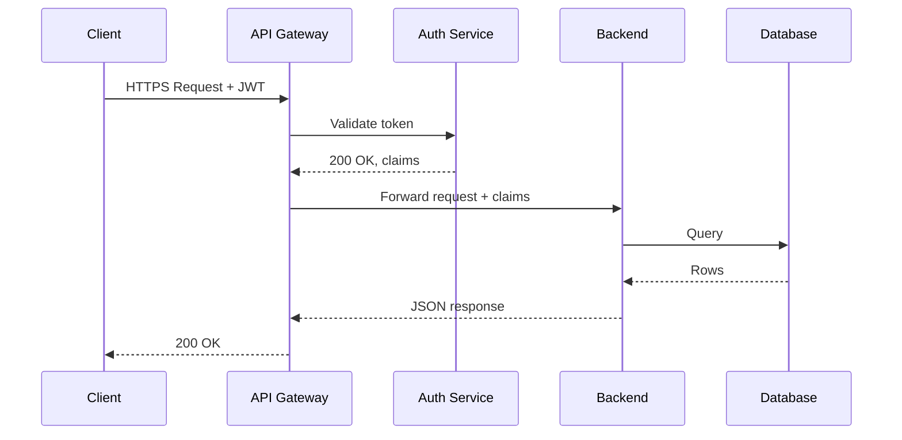
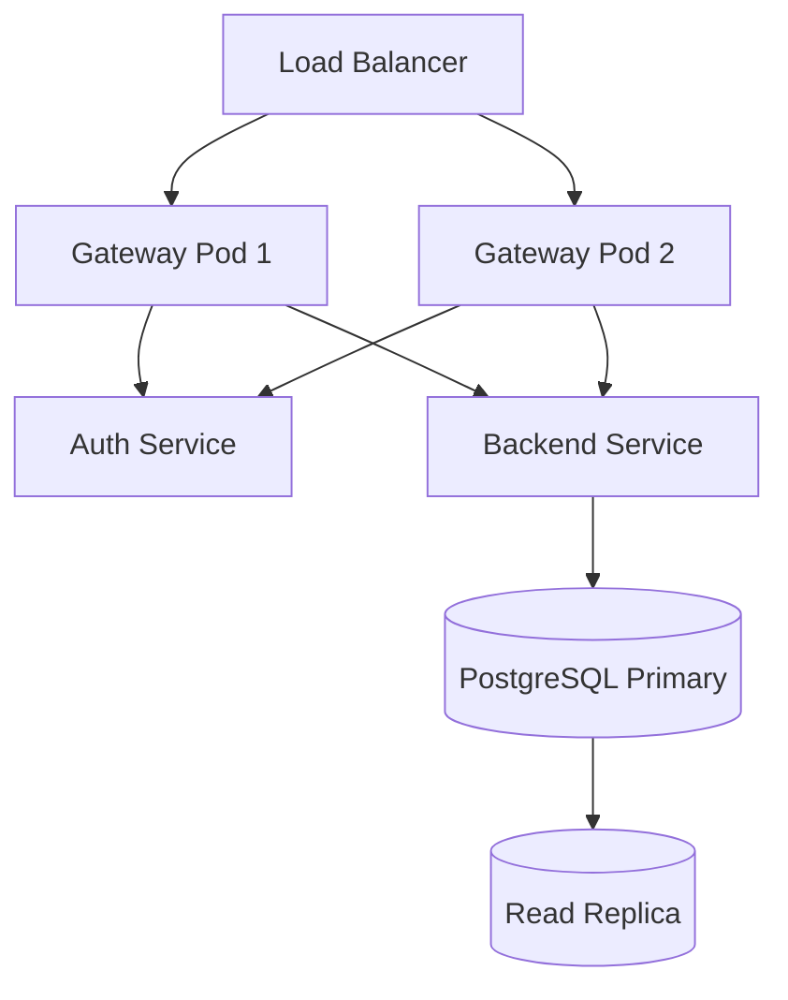

# System Design Overview

This document describes the request lifecycle.

## Components

| Component | Role | Language |
|-----------|------|----------|
| API Gateway | TLS termination, routing | Go |
| Auth Service | JWT validation | Go |
| Backend | Business logic | Go |
| Database | Persistence | PostgreSQL |

## Request Flow

## Deployment Topology

## Error Rates

| Endpoint | p50 | p99 | Error % |
|----------|-----|-----|---------|
| `/api/users` | 4ms | 18ms | 0.01% |
| `/api/orders` | 12ms | 95ms | 0.03% |
| `/api/search` | 28ms | 210ms | 0.08% |
